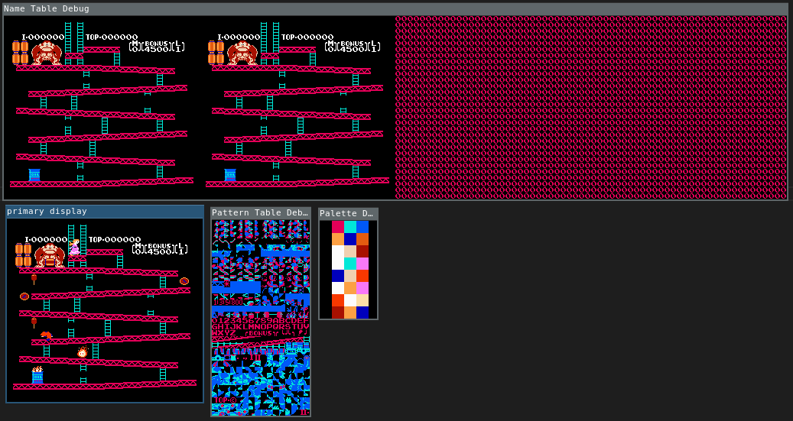

# dnes
simple NES emulator written in D

Cpu passes nestest.nes but probably isn't cycle perfect. Currently only supports nrom (ines 0) mapper. Ppu rendering is a hack. Apu is not implemented. Can run Donkey Kong, that's about it.

Hard coded keymap: arrow keys, A, S, Z, X

